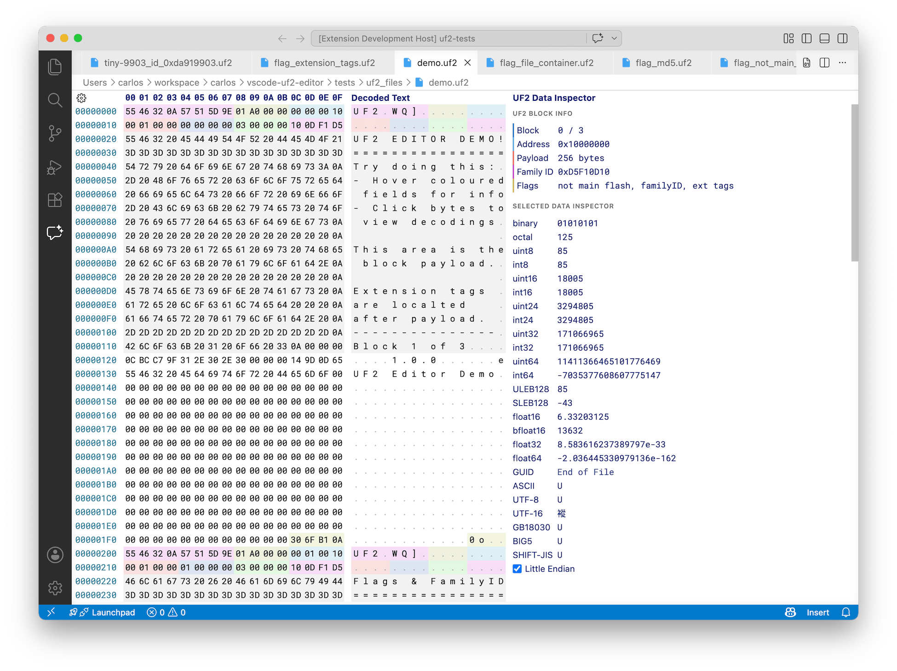

# VS Code UF2 Editor

Visual Studio Code extension that provides an editor for viewing and
manipulating [UF2](https://github.com/microsoft/uf2) files.



To view this extension in action you can test it out in VSCode online via Github.dev:
https://github.dev/carlosperate/vscode-uf2-editor/blob/main/tests/uf2_files/demo.uf2

There is also a standalone UF2 web viewer based on this extension:
https://carlosperate.github.io/vscode-uf2-editor/

## Features

- Open UF2 files directly in VS Code.
- **UF2 Data Inspector**: decoded view of every UF2 block field (address, payload size, flags, family ID, extension tags, file container info) alongside the raw hex.
- Coloured hex fields based on UF2 metadata for easy block inspection.
- Editing with undo, redo, copy, and paste support.
- Find and replace.
- Based on Microsoft's VS Code Hex Editor extension.

## How to Use

There are four ways to open a file in the UF2 editor:

1. A file with the `.uf2` extension will automatically open in the UF2 editor when double-clicked.
2. Right click a file -> Open With -> UF2 Editor
3. Trigger the command palette (<kbd>F1</kbd>) -> Open File using UF2 Editor
4. Trigger the command palette (<kbd>F1</kbd>) -> Reopen With -> UF2 Editor

The UF2 editor can be set as the default editor for additional file types by using the `workbench.editorAssociations` setting. For example, this would associate all files with extensions `.bin` to use the UF2 editor by default:

```json
"workbench.editorAssociations": {
    "*.bin": "uf2Editor.uf2edit"
},
```

## Known Issues

To track existing issues or report a new one, please visit the GitHub Issues page at https://github.com/carlosperate/vscode-uf2-editor/issues

## License & Acknowledgments

This extension is a fork of the
[Microsoft VS Code Hex Editor](https://github.com/microsoft/vscode-hexeditor).
We are grateful to Microsoft and all the contributors who built the original
hex editor extension that made this project possible.

MIT License, see [LICENSE](https://github.com/carlosperate/vscode-uf2-editor/blob/main/LICENSE) file for details.

Original extension work Copyright (c) Microsoft Corporation.
Updated UF2 support Copyright (c) 2025-2026 Carlos Pereira Atencio.

Fork updates are listed in the [changelog](https://github.com/carlosperate/vscode-uf2-editor/blob/main/CHANGELOG.md)
and can be viewed in [this GitHub diff](https://github.com/carlosperate/vscode-uf2-editor/compare/7d97ac4003059cdefc8f533a6ad7381fe8ae0435...main).
